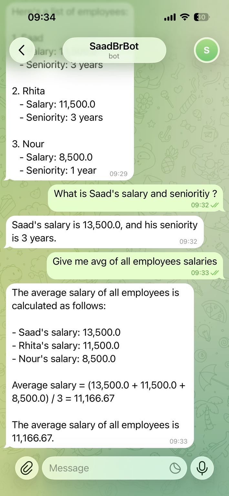
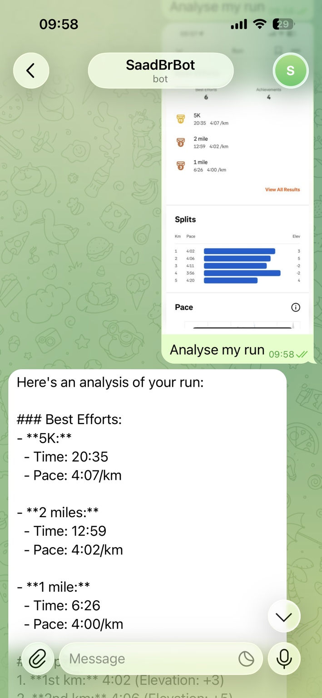
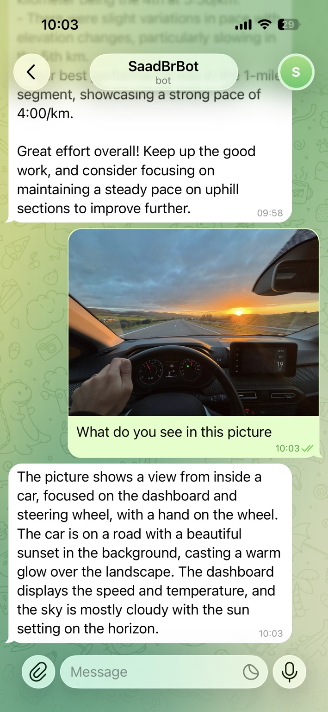
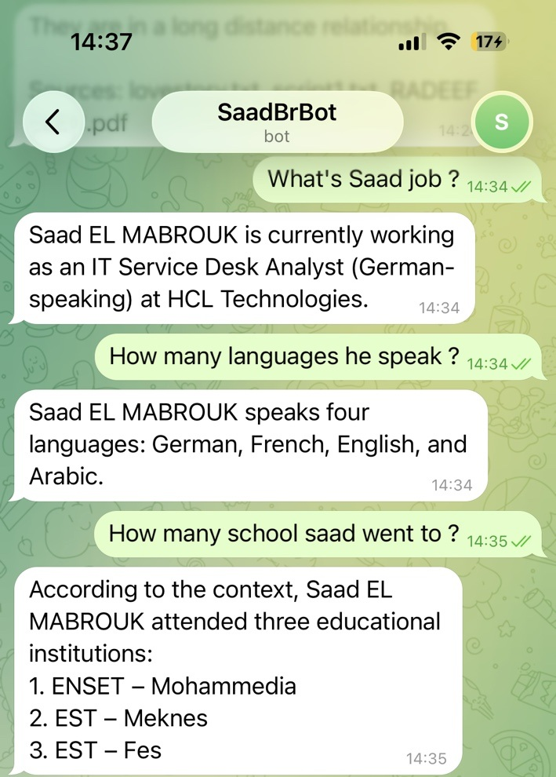
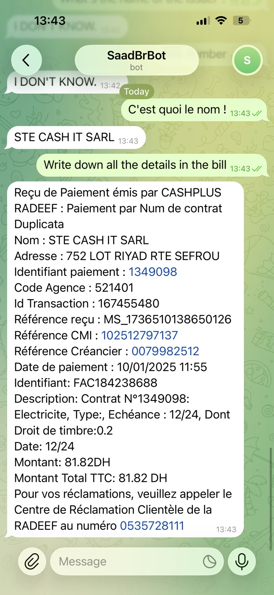
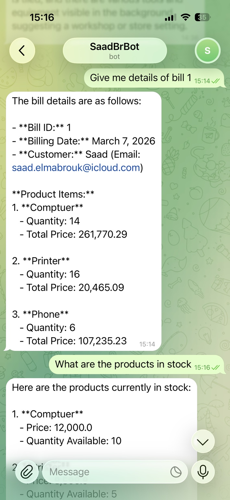
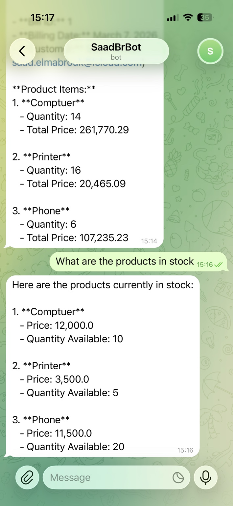

# SaadBrBot — Telegram AI Chatbot (MCP + RAG + Microservices)

SaadBrBot is a Spring Boot chatbot running on **Telegram** that combines:

- **MCP Tools** for structured actions and calculations
- **RAG (Retrieval-Augmented Generation)** with **PostgreSQL + pgvector** for grounded answers from documents
- **Microservices integration** (Spring Cloud + Eureka + Gateway + Feign) to fetch **live business data** (customers, products, bills)
- **Vision / image understanding** (answer questions about images sent on Telegram)

This project is the continuation of **[ecom-ms-app](https://github.com/saadBr/ecom-ms-app)**: build the e-commerce microservices first, then integrate the chatbot into the same microservices architecture and make it consume those services.

---

## Architecture

### Platform services
- **Discovery Service**: Eureka
- **Config Service**: Spring Cloud Config Server
- **API Gateway**: Spring Cloud Gateway

### Business services (Activity 1)
- **CUSTOMER-SERVICE**
- **INVENTORY-SERVICE**
- **BILLING-SERVICE**

### Chatbot service
- **SAADBR-BOT** (this project)
  - registers in **Eureka**
  - reachable via **Gateway**
  - consumes services via **OpenFeign**
  - uses **pgvector** for RAG

---

## Key Features

### 1) MCP Tools (tool calling)
The bot can execute structured tool operations (example: employee salary/seniority lookup, average salary calculation) through MCP tools.

### 2) RAG (pgvector)
The bot retrieves relevant chunks from a vector database and answers using that context (reduces hallucinations).

### 3) Microservices (live data)
For business questions, the bot queries the microservices (customer/product/bill) via Feign + Eureka (live, up-to-date results).

### 4) Vision (images)
When a user sends an image, the bot can describe it and answer questions about what it contains.

---

## Tech Stack

- Java 21
- Spring Boot 3.5.x
- Spring Cloud 2025.x (Eureka, Gateway, Config)
- Spring AI (LLM + tools + RAG)
- PostgreSQL + pgvector
- OpenFeign
- Telegram Bots (Long Polling)

---

## Project Structure (example)

```
src/main/java/net/saadbr/saadbrbot/
  agents/      # AIAgent (routing: live-data vs RAG vs vision)
  clients/     # Feign clients (Customer/Inventory/Billing)
  tools/       # Tool layer (EcomTools)
  telegram/    # Telegram bot (updates -> AIAgent)
docs/screenshots/
```

---

## Configuration

Use environment variables (recommended):

- `OPENAI_API_KEY`
- `TELEGRAM_API`

Typical settings:

```properties
spring.application.name=saadbr-bot
server.port=8087

spring.ai.openai.api-key=${OPENAI_API_KEY}
telegram.api.key=${TELEGRAM_API}

# RAG (pgvector)
spring.datasource.url=jdbc:postgresql://localhost:5432/ragdb
spring.datasource.username=rag
spring.datasource.password=rag
spring.ai.vectorstore.pgvector.initialize-schema=true

# Eureka
eureka.client.serviceUrl.defaultZone=http://localhost:8761/eureka
```

---

## Running (local)

1) Start **Discovery (Eureka)**
2) Start **Config Service**
3) Start **Gateway Service**
4) Start e-commerce microservices: **Customer**, **Inventory**, **Billing**
5) Start **SAADBR-BOT**

Verify registration in Eureka UI:
- `SAADBR-BOT` is **UP**
- `CUSTOMER-SERVICE` / `INVENTORY-SERVICE` / `BILLING-SERVICE` are **UP**

---

## Gateway access (Discovery Locator)

If your gateway uses discovery locator, service endpoints are reachable like:

- Customers: `http://localhost:8888/CUSTOMER-SERVICE/customers`
- Customer by id: `http://localhost:8888/CUSTOMER-SERVICE/customers/1`
- Bot endpoint: `http://localhost:8888/SAADBR-BOT/chat?message=hi`

---

## Demo prompts

### MCP tools
- “What is Saad's salary and seniority?”
- “Give me avg of all employees salaries”

### Microservices (live)
- “customer 1”
- “customers”
- “products”
- “bill 1”
- “What are the products in stock?”

### RAG
- “What's Saad job?”
- “How many languages does Saad speak?”
- “How many schools Saad went to?”

### Vision
- Send an image → “What do you see in this picture?”

---

## Screenshots (Evidence)

### MCP tools demo


### RAG demo (run analysis)


### Vision demo


### RAG demo (profile / education / languages)


### RAG demo (receipt/bill extraction)


### Microservices demo (bill details + stock)


### Microservices demo (stock list)


---

## Notes
- RAG is used for **knowledge/documents**.
- Feign is used for **live business data** (microservices).
- MCP tools are used for **structured actions/calculations**.
- Images are handled in a separate path to avoid blocking on RAG.

---

## Author
Saad EL MABROUK
